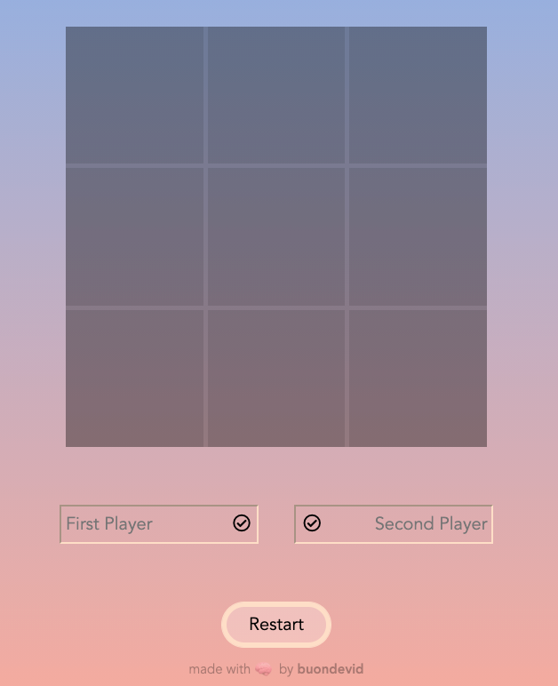
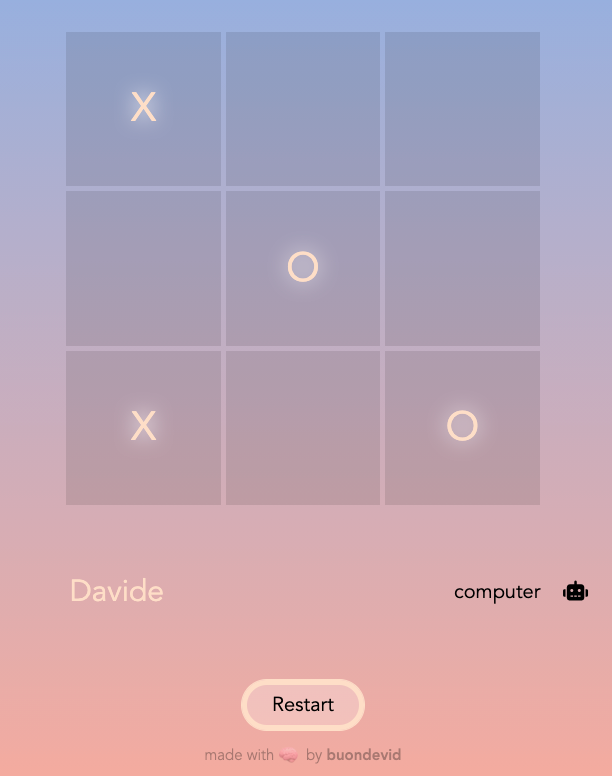
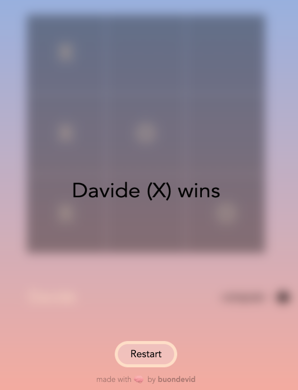

<h1 align='center'>Tic Tac Toe</h1> 
<h3 align='center'>XOXO, when it doesn't mean hugs and kisses</h3>

This app was created using only HTML, CSS and Vanilla JS.

This project is part of The Odin Project's curriculum, built to pratice what I've learnt.

It's a Tic Tac Toe game for 2 players or for 1 player VS the AI. To play against the computer you will have to write 'computer' in the second input field, as written in the instructions. It's fully responsive so that you can play on mobile too!
N.B. AI just makes a random move, it's not a smart one.

:link: **Live preview:** [here](https://buondevid.github.io/tic-tac-toe/)

:link: **GitHub repo:** [here](https://github.com/buondevid/tic-tac-toe)

## Stack & Tools  :hammer:

- HTML
- CSS
- Vanilla JS
- VS Code + ESLint + Node
- Git & GitHub

## What I learned :book:

- Made concrete us of **Module revealing patterns** and **factory functions**, as preferred over plain **constructors**.
- Learned modular developing and to split everything into small problems/objects.
- Improved **DOM manipulation** and usage of **event listeners**.
- Learned how *set* and *get* methods work and the logic behind. Studied *private* and *public* methods.
	- Tested how important it is with **IIFE** (Immediately Invoked Functions Expressions).
- Explored new **CSS** concepts like *webpack*, `var()` and `attr()`.
	- Mastered **animation** and **transitions** with JS `.classList` manipulations.
- Found a stable workaround for using *viewport* units on iOS, without disruptions.

## What could be improved :mag: 

* Study the minimax algorithm to make an unbeatable AI.
* Better dividing of properties and methods between *modules*.

## Author

:moyai: **buondevid** --> [GitHub](https://github.com/buondevid)